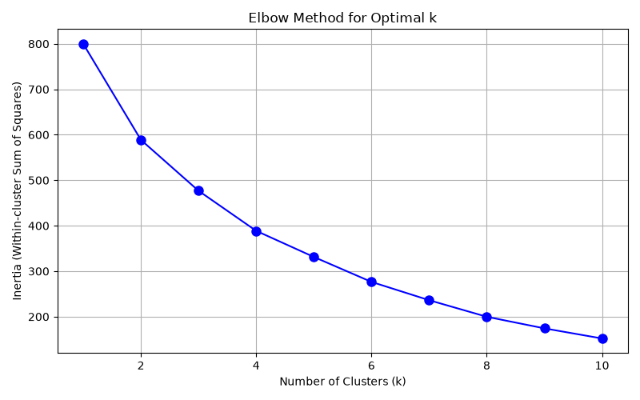
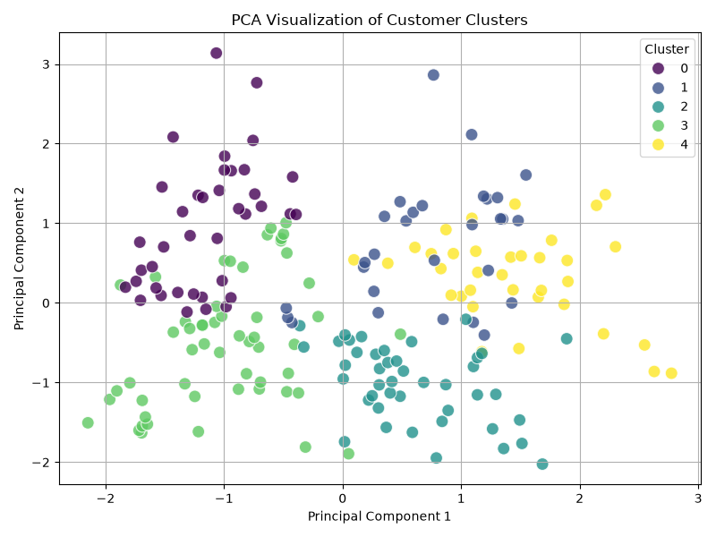

# AI-ML Assignment 7: Customer Segmentation

## Student Information
- **Name:** Abhilash Choudhary
- **Registration Number:** 23BCE11155
- **Application Number:** IN26012658

---

## Objective
The objective of this assignment is to segment the customers of a shopping mall based on their annual income and spending behavior. By clustering the customers into distinct groups, the mall management can perform targeted marketing campaigns and design customer-centric business strategies. 

To achieve this, we:
1. Conducted exploratory data analysis to understand the dataset.
2. Preprocessed and scaled the features to prepare them for clustering.
3. Applied **K-Means Clustering** to segment the customers.
4. Used **Principal Component Analysis (PCA)** to reduce the feature space to 2 dimensions for visual inspection of the clusters.

---

## Dataset Link
The dataset used is the **Mall Customer Segmentation Dataset**:
- [Kaggle Dataset Link](https://www.kaggle.com/datasets/vjchoudhary7/customer-segmentation-tutorial-in-python)

*(Note: The `Mall_Customers.csv` file is included in this repository).*

---

## Libraries Used
- **Pandas**: Data loading, manipulation, and analysis.
- **NumPy**: Numerical computations.
- **Scikit-learn**: Feature scaling (StandardScaler), categorical encoding (LabelEncoder), clustering (KMeans), and dimensionality reduction (PCA).
- **Matplotlib**: Basic plotting and visualization.
- **Seaborn**: High-level statistical visualization and scatter plots.

---

## Methodology
The implementation follows a structured pipeline:
1. **Data Understanding**: Loaded the data, identified numerical/categorical features, and inspected shape and summary statistics.
2. **Data Preprocessing**: Checked for missing values, dropped the non-informative `CustomerID` column, encoded the categorical `Gender` column, and standardized all columns using `StandardScaler` so that features are on a comparable scale.
3. **Determining K (Elbow Method)**: Computed the within-cluster sum of squares (inertia) for values of K ranging from 1 to 10 and plotted the Elbow curve. The elbow was identified at K=5.
4. **Model Training**: Trained a K-Means clustering model with 5 clusters on the scaled dataset.
5. **Dimensionality Reduction (PCA)**: Used PCA to project the 4D feature space down to 2 principal components to capture maximum variance and enable 2D visualization of cluster boundaries.

---

## Results
The Elbow Method was used to determine the optimal number of clusters by plotting the Within-Cluster Sum of Squares (Inertia) against the number of clusters $K$. 

The optimal number of clusters was determined to be **K=5** because:
- **Elbow Point:** The curve shows a distinct inflection point (elbow) at $K=5$.
- **Diminishing Returns:** The drop in inertia is very steep from $K=1$ to $K=5$, but becomes significantly slower and more linear after $K=5$, meaning adding more clusters yields diminishing returns.

The 5 customer clusters are profiled as follows:

| Cluster ID | Cluster Name | Average Age | Average Income (k$) | Average Spending Score | Gender Distribution |
| :--- | :--- | :---: | :---: | :---: | :---: |
| **Cluster 0** | High Income, High Spenders (Target Group) | ~32.7 years | ~$86.5k | ~82.1 | ~53.8% Female |
| **Cluster 1** | High Income, Low Spenders (Savers) | ~36.5 years | ~$89.5k | ~18.0 | ~55.2% Female |
| **Cluster 2** | Older Females, Mid Income/Spending | ~49.8 years | ~$49.2k | ~40.1 | 100% Female |
| **Cluster 3** | Young, Low Income, High Spenders | ~24.9 years | ~$39.7k | ~61.2 | ~59.3% Female |
| **Cluster 4** | Older Males, Mid Income/Spending | ~55.7 years | ~$53.7k | ~36.8 | 100% Male |

*PCA successfully reduced the 4D space into 2 principal components, explaining approximately 60% of the total variance, which made it possible to visually inspect the cluster boundaries and confirm clear segregation.*

---

## Conclusion
In this assignment, we successfully performed customer segmentation on the Mall Customer dataset using K-Means Clustering and visualized the results in 2D using PCA. By standardizing the features (Age, Gender, Annual Income, and Spending Score), we identified 5 distinct customer groups. These segments enable targeted marketing campaigns, such as offering premium catalogs to high-income spenders and loyalty rewards to younger groups. A major limitation of K-Means is its sensitivity to feature scaling and spherical shape assumptions. In contrast, PCA is highly advantageous for reducing dimensions and enabling visual inspection of complex customer profiles in a 2D space.
